There are two *obvious* ways to use coding agents. Both are bad.  
有两种明显的方法使用编码代理。两者都是糟糕的。

The first is to let the LLM run unattended and hope the repository survives. This is fast, exciting, and stupid. It leads to bugs, confused changes, and a flood of PRs that humans cannot review quickly enough, at least not without eventually lowering their standards and merging things they do not really understand.  
第一种是让 LLM 无监督运行，并希望仓库能够幸存。这是快速的、令人兴奋的，也是愚蠢的。它会导致错误、混乱的变更，以及人类无法快速审查的 PR 洪流，至少在不最终降低标准并合并他们并不真正理解的东西的情况下是无法做到的。

The second approach is to treat the agent like glorified autocomplete and force a human to review every tiny step. This is safer, but slow enough to partially defeat the purpose of using an agent in the first place. If you still have to steer every minor decision, you have not delegated much.  
第二种方法是像高级自动完成一样对待代理，并强制人类审查每一步。这是更安全的，但慢到足以部分抵消使用代理的初衷。如果你仍然要指导每一个小决定，那么你没有进行多少授权。

In this post, I’ll cover a third, not-so-obvious approach: building ways for the agent to validate more of its own work before a human has to step in. The goal to make longer unattended sessions safe enough to be useful without fully removing the human from the loop. It should also reduce the number of low-quality PRs your teammates have to review for details the agent should have caught itself.  
在这个帖子中，我将涵盖一种第三种、不太明显的方法：为代理构建方法，使其在人类介入之前能够验证更多自己的工作。目标是使更长的无人值守会话安全到足以被使用，同时不让人类完全脱离循环。它还应减少您的队友必须审查的低质量 PR 的数量，这些细节代理本应自己捕获。

## What backpressure is and how it can help背压是什么以及它如何提供帮助

**In systems engineering, backpressure is the mechanism by which a downstream component signals upstream that it can't accept more work, forcing the producer to slow down, buffer, or shed load.  
在系统工程中，背压是下游组件向上游发出信号，表明它无法接受更多工作的机制，迫使生产者放慢速度、缓冲或卸载负载。**

Whenever there's no backpressure, the producer is free to generate work at will, and the consumer is forced to absorb the mismatch. Then, the consumer either falls behind, breaks under the load, or speeds up by cutting corners.  
当没有背压时，生产者可以随意生成工作，而消费者被迫吸收不匹配。然后，消费者要么落后，要么在负载下崩溃，要么通过走捷径加速。

In our work, backpressure usually takes the form of a machine refusing work the producer hasn't cleaned up yet. The simplest version of that is an automated test: you don't usually submit a PR with failing tests. Ideally, your colleagues shouldn't even review a PR until all tests are green. In that case, the test suite is the backpressure mechanism for a human to clean up their code before asking for a review.  
在我们的工作中，背压通常表现为机器拒绝处理生产者尚未清理的工作。最简单的版本是一个自动化测试：通常你不会提交带有失败测试的 PR。理想情况下，你的同事甚至不应该在所有测试都变绿之前审查 PR。在这种情况下，测试套件就是让人类在请求审查之前清理代码的背压机制。

[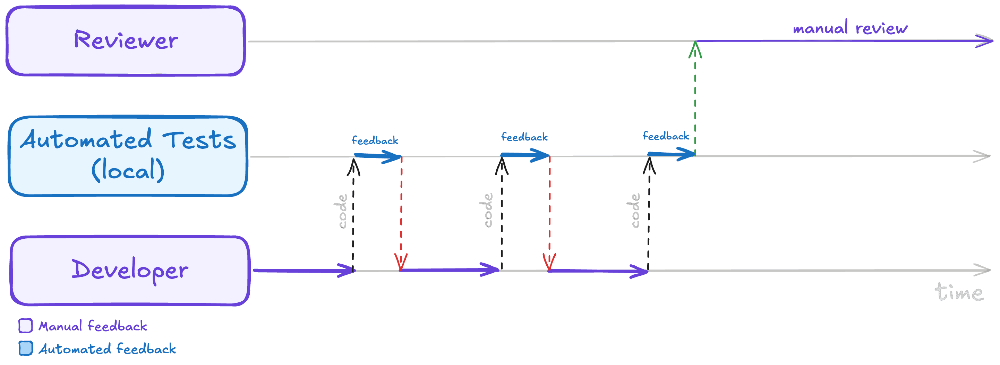](https://www.lucasfcosta.com/assets/backpressure-is-all-you-need/tests-backpressure.png "Click to enlarge")

Automated tests are backpressure: the developer iterates against fast local test feedback, so the reviewer only ever sees code that's already green.  
自动化测试就是背压：开发者通过快速的本地测试反馈进行迭代，因此审查者看到的代码永远是已经变绿的。

In addition to automated testing, types can also be a powerful form of backpressure.  
除了自动化测试，类型也可以是一种强大的背压形式。

Remember writing plain JavaScript, for example. Back in those days, it was easy to wire a component with the wrong prop shape and only find out much later, when someone clicked a button and got hit in the face with `props.onSubmit is not a function`.  
记得写原始 JavaScript 吗，比如。在那些日子里，很容易将组件连接到错误的属性形状，而且直到有人点击按钮并直接面对 `props.onSubmit is not a function` 的错误时，才发现这个问题。

Before TypeScript, the only way to catch the bug before production was for a reviewer to follow the prop, follow the callback, check the caller, check the caller's caller, and hope the mismatch was visible in the diff.  
在 TypeScript 出现之前，在生产环境之前捕获错误的唯一方法就是让审查者跟踪属性，跟踪回调，检查调用者，检查调用者的调用者，并希望不匹配在差异中是可见的。

Some of us learned a lesson from these difficult times and started using types to [make impossible states impossible](https://www.youtube.com/watch?v=IcgmSRJHu_8). Others looked at the same lesson, nodded solemnly, and kept passing dictionaries around, but I guess that's a story for another day.  
我们中的一些人从这些艰难的时期中学到了教训，开始使用类型来使不可能的状态变得不可能。其他人看到了同样的教训，庄重地点了点头，继续传递字典，但我猜那将是另一天的故事。

Anyway, the point here is that TypeScript added backpressure and made the producer confront the consumer's expectations before moving the code forward. Now, if a component needs a function, you can't casually hand it a string, an object, or nothing at all and hope the reviewer catches the bug. Instead, the machine will refuse the work at the boundary where you introduced the type mismatch, with no need for an expensive human review.  
无论如何，这里的要点是 TypeScript 增加了背压，并让生产者在继续执行代码前直面消费者的期望。现在，如果一个组件需要函数，你不能随意地给它一个字符串、一个对象或者什么都没有，然后希望审查者能发现这个 bug。相反，机器会在你引入类型不匹配的边界拒绝执行工作，无需昂贵的人工审查。

[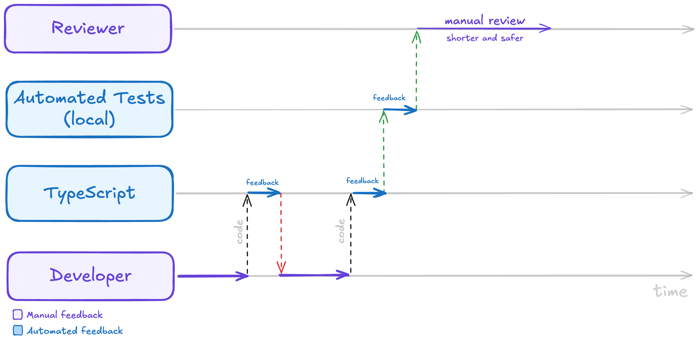](https://www.lucasfcosta.com/assets/backpressure-is-all-you-need/types-backpressure.png "Click to enlarge")

Types add another layer of backpressure ahead of the tests, refusing mismatches at the boundary and making the eventual human review shorter and safer.  
类型在测试之前增加了另一层背压，拒绝边界处的错误匹配，并使最终的人工审查更短、更安全。

As time passed, we kept adding more automated guardrails to the process, like linters, end-to-end tests, canary releases, and so on. We then bundled a bunch of those guardrails into CI pipelines. That way, we could stop reviewing code that wasn't even close to being ready, and we could focus our human attention on the things that machines can't check, like readability, complexity, and overall design.  
随着时间的推移，我们不断为流程添加更多的自动化防护措施，比如代码检查工具、端到端测试、金丝雀发布等等。然后我们将这些防护措施捆绑到持续集成管道中。这样我们就可以停止审查那些远未准备好的代码，并将人类的注意力集中在机器无法检查的事情上，比如可读性、复杂性和整体设计。

Today, this lesson is easy to recognize when we're talking about compilers, automated tests, CI, and, for the true believers among us, types. However, it seems much harder to recognize when the producer is an LLM writing code faster than anyone can read it.  
今天，当我们谈论编译器、自动化测试、持续集成，以及对于我们中的真正信徒来说的类型时，这门课很容易被识别。然而，当生产者是一个写代码的速度比任何人都能读得快的 LLM 时，这似乎要困难得多。

That's why, most of the time, **the LLM's backpressure is still us**. We look at the code in the editor, ask the model to fix the parts that smell wrong (multiple times), open the PR, fix any failing checks, and then someone looks at the same code again with a more serious face.  
这就是为什么，大多数时候，LLM 的背压仍然是我们。我们查看编辑器中的代码，要求模型修复那些有问题的部分（多次），打开 PR，修复任何失败的检查，然后有人再次以更严肃的表情查看相同的代码。

[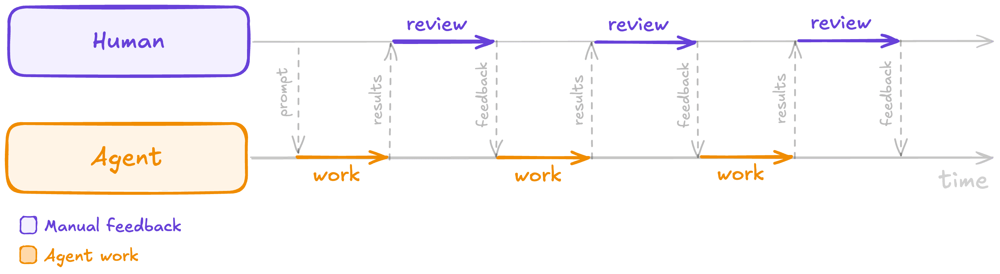](https://www.lucasfcosta.com/assets/backpressure-is-all-you-need/human-backpressure.png "Click to enlarge")

With no automated backpressure, the human is the backpressure—manually reviewing the agent's output and feeding corrections back every cycle.  
在没有自动背压的情况下，人是背压——手动审查代理的输出并在每个周期反馈修正。

Often, for extra safety, we install a review bot to check the first AI's code. Then, we copy the bot's feedback back into the coding agent. That way, we have ironically promoted ourselves to an expensive clipboard doing the mechanical work between two machines.  
通常，为了额外的安全，我们会安装一个审查机器人来检查第一个 AI 的代码。然后，我们将机器人的反馈复制回编码代理。这样，我们讽刺地提升了自己，变成了一个昂贵的剪贴板，在两台机器之间做机械工作。

**The next step for AI-aided software development is to stop making humans the default backpressure in the AI loop**. We need tests that fail early, types that push back, benchmarks that catch regressions, and review agents that send bad patches back before they become a human's problem. That machinery is what makes delegation possible, and frees up our time to focus on higher-level feedback and design decisions instead of low-level correctness and quality issues.  
AI 辅助软件开发下一步是要停止将人类设为 AI 循环中的默认背压。我们需要能尽早失败的测试、能产生反作用的类型、能捕捉倒退的基准测试，以及能将在变成人类问题之前就退回不良补丁的审查代理。正是这种机制使得委托成为可能，并让我们有更多时间专注于高层次的反馈和设计决策，而不是低层次的正确性和质量问题。

[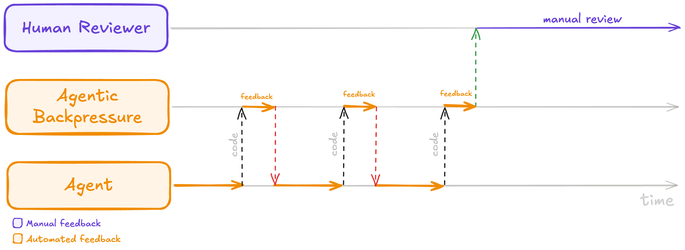](https://www.lucasfcosta.com/assets/backpressure-is-all-you-need/agentic-backpressure.png "Click to enlarge")

With automated backpressure in place, the agent iterates against fast automated feedback and the human only steps in for a final manual review.  
有了自动背压机制，代理会针对快速自动反馈进行迭代，而人类只需进行最终的手动审查。

Next, I'll explain how I've been building that machinery in my work, how you can do the same, and interesting approaches I've yet to explore.  
接下来，我将解释我在工作中是如何构建那台机械的，你可以如何做到同样的事情，以及我尚未探索的一些有趣方法。

You can install this post's backpressure skills by running `npx @lucasfcosta/backpressured` in your terminal. Then, run `/backpressured <goal description>` in Claude — or explicitly ask Claude to use the backpressured skill — to kick off the loop.  
你可以通过在终端中运行 `npx @lucasfcosta/backpressured` 来安装这篇帖子的背压技能。然后，在 Claude 中运行 `/backpressured <goal description>` — 或者明确要求 Claude 使用背压技能 — 来启动循环。

That skill will automatically iterate towards the goal while running the backpressure checks described in this post. You can also customize the checks and the iteration process by adding a `BACKPRESSURE.md` file to your project with more specific instructions (in plain English).  
该技能在运行本文中描述的背压检查时将自动迭代至目标。您还可以通过向项目中添加一个包含更具体说明（以英文编写）的 `BACKPRESSURE.md` 文件来自定义检查和迭代过程。

## Creating backpressure in practice在实践中创建背压

The first time I applied backpressure to an LLM, I was using [Claude's `/goal` command](https://code.claude.com/docs/en/goal). That command lets you give Claude a goal and have it keep working until it considers the goal complete.  
我第一次将背压应用于 LLM 时，正在使用 Claude 的 `/goal` 命令。该命令允许您给 Claude 设定一个目标，并让它持续工作直到认为目标完成。

Initially, my `/goal` prompts looked something like this:  
最初，我的 `/goal` 提示看起来有点像这样：

```
/goal implement support for <brief feature description>. You should only consider the task done when all of the following criteria are met:

1. <first criterion: i.e. the button X must be disabled while the form is submitting>
2. <second criterion: i.e. the front-end must show an error message if the API returns a 400>
3. <third criterion: i.e. redirect the user to the dashboard after a successful submission>
```

The problem with this type of prompt is that it focused too much on the feature and not enough on the necessary tests, possible edge cases, and overall quality of the implementation. Essentially, there were no guardrails to prevent the model from declaring victory too early, so it often did. Then, it was up to me to review the code and handhold the model through the process of handling each edge case, adding tests, and refactoring the code until it was good enough to ship. That defeated the purpose of `/goal`, which was supposed to let me delegate the work and only get involved at the end to review the final product.  
这类提示的问题在于它过于关注功能而忽略了必要的测试、可能的边缘情况以及整体实现质量。本质上，没有设置任何防护措施来防止模型过早宣布胜利，所以它经常这样做。然后，就轮到我审查代码，并手把手地指导模型处理每个边缘情况、添加测试以及重构代码，直到它足够好可以发布。这违背了 `/goal` 的初衷，它本应是让我分配工作，只在最后审查最终产品的。

That's when I noticed I was wasting my time as a slow backpressure mechanism instead of building automated backpressure into the loop. I was bottlenecking `/goal`!  
那时我意识到，我正把时间浪费在一个缓慢的后压机制上，而不是在循环中构建自动后压。我在 `/goal` 上形成了瓶颈！

After noticing that, I started adding the following backpressure mechanisms into the `/goal` loop:  
注意到这一点后，我开始在 `/goal` 循环中添加以下后压机制：

1. Linting, testing, and simple verification scripts  
	代码检查、测试和简单的验证脚本
2. Manual testing with `cURL` and an actual browser  
	使用 `cURL` 和实际浏览器进行手动测试
3. Benchmarking 基准测试
4. Review agents (functional, tests, types, brevity)  
	审查代理（功能、测试、类型、简洁性）
5. Planning phase review 规划阶段审查
6. Visual design reviews 视觉设计评审
7. Pull-request monitoring 拉取请求监控

I'll cover each of these mechanisms in more detail below, but the general idea is that I kept adding more and more automated checks and reviews into the loop, so that the model would have to confront the consumer's expectations more frequently and catch issues on its own before they became my problem.  
我将更详细地介绍这些机制，但总体思路是不断增加自动检查和审核环节，以便模型能够更频繁地直面消费者的期望，并在问题成为我的麻烦之前自行发现并解决。

### 1\. Linting, testing, and simple verification scripts1. 代码风格检查、测试和简单的验证脚本

These are the simplest and most obvious forms of backpressure. If your project already has a test suite and a linter, you can start using them as backpressure mechanisms right away.  
这些都是最简单和最明显的背压形式。如果你的项目已经有一个测试套件和一个代码检查工具，你可以立即开始使用它们作为背压机制。

In fact, Claude already picks up tests most of the time, but as it goes along, it sometimes forgets to keep them green. Consequently, I decided to explicitly extend my prompt with checks for testing. Then, I also added other easy wins like linting and running other simple verification scripts, like a commit-message checker.  
事实上，Claude 大部分时间都能自动检测测试，但随着时间推移，它有时会忘记保持它们为绿色状态。因此，我决定通过添加测试检查来显式扩展我的提示。然后，我还添加了其他一些简单的改进，比如代码检查和运行其他简单的验证脚本，例如提交信息检查器。

Another important thing I discovered is that **it's extremely useful to ask the model to run the checks in *each* iteration, not just at the end**. By running the checks in each iteration, I forced the model to confront the consumer's expectations more frequently, which made it more likely to catch issues early and fix them before moving on to the next step.  
我发现的另一个重要事情是，要求模型在每个迭代中运行检查，而不仅仅是在最后运行，这非常有用。通过在每个迭代中运行检查，我迫使模型更频繁地面对消费者的期望，这使得它更有可能尽早发现问题并在继续下一步之前进行修复。

```
/goal implement support for <brief feature description>. Here are the feature's acceptance criteria:
 
1. <first criterion: i.e. the button X must be disabled while the form is submitting>
2. <second criterion: i.e. the front-end must show an error message if the API returns a 400>
3. <third criterion: i.e. redirect the user to the dashboard after a successful submission>
 
The task is not done until all of the above acceptance criteria are satisfied. Additionally, the following quality criteria must also be met:
 
1. The linting is passing
2. Tests are all green
3. The new behavior is covered by tests
4. The commit_check.sh script is passing
 
Run these quality checks in _each_ iteration. Do NOT wait until the end to run them. You should run them after writing each patch, and you should not write a new patch until all checks are passing.
 
If any of the above criteria are not met, you must inspect the failure, fix the issue, and run the check again. Do not stop after writing the patch. Stop only after the acceptance criteria are satisfied, or after you can explain exactly what is blocking you.
```

Now, my prompt had the structure below.  
现在，我的提示具有以下结构。

[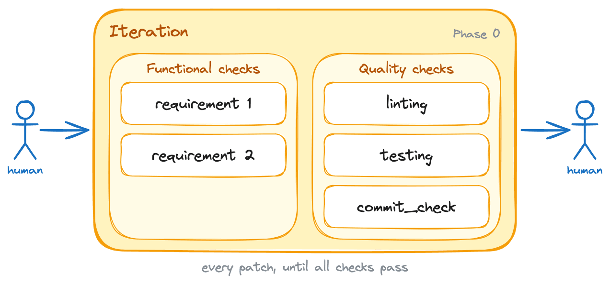](https://www.lucasfcosta.com/assets/backpressure-is-all-you-need/01-iteration.png "Click to enlarge")

The starting point: a single iteration phase where every patch must satisfy the functional requirements and pass the quality checks.  
起点：一个单次迭代阶段，其中每个补丁必须满足功能要求并通过质量检查。

### 2\. Manual testing with cURL and an actual browser2. 使用 cURL 和实际浏览器进行手动测试

Even though I wrote [500 pages on automated testing](https://www.manning.com/books/testing-javascript-applications), I'm well aware of its limitations. Automated tests are great for catching a wide range of issues, but they can't catch everything, and they certainly aren't as representative as clicking around in an actual browser or running `cURL` commands against a real API.  
尽管我写了 500 页关于自动化测试的内容，但我非常清楚它的局限性。自动化测试非常适合捕捉各种问题，但它们并不能捕捉所有问题，而且它们肯定不如在实际浏览器中点击或对真实 API 运行 `cURL` 命令那么具有代表性。

I covered that gap by adding manual testing into the loop. For that, **I had to teach the model how to run my front-end and back-end applications locally**. I also had to teach it how to run my `docker-compose` file, set up database schemas, and troubleshoot common issues that come up when running the applications locally.  
我通过在流程中加入手动测试来弥补了那个缺口。为此，我必须教会模型如何在本地运行我的前端和后端应用程序。我还必须教会它如何运行我的 `docker-compose` 文件，设置数据库模式，以及排查在本地运行应用程序时出现的常见问题。

I used the [`obra/superpowers` builder](https://github.com/obra/superpowers/tree/f2cbfbefebbfef77321e4c9abc9e949826bea9d7/skills/writing-skills) to build the skills that taught the agent how to run my applications.  
我使用 `obra/superpowers` 构建器来构建教授代理运行我的应用程序的技能。

Then, I updated the prompt to make Claude use those skills for manual checks.  
然后，我更新了提示，让 Claude 使用这些技能进行手动检查。

```
/goal implement support for <brief feature description>. Here are the feature's acceptance criteria:
 
1. <first criterion: i.e. the button X must be disabled while the form is submitting>
2. <second criterion: i.e. the front-end must show an error message if the API returns a 400>
3. <third criterion: i.e. redirect the user to the dashboard after a successful submission>
 
The task is not done until all of the above acceptance criteria are satisfied. Additionally, the following quality criteria must also be met:
 
1. The linting is passing
2. Tests are all green
3. The new behavior is covered by tests
4. The commit_check.sh script is passing
 
Run these quality checks in _each_ iteration. Do NOT wait until the end to run them. You should run them after writing each patch, and you should not write a new patch until all checks are passing.
 
After you're done iterating, use the \`run_local_dependencies\`, \`run_backend\`, and \`run_frontend\` skills to run the application locally and test the new behavior manually. You can use \`cURL\` commands to test the API endpoints and the Playwright MCP to test the front-end on a real browser. You should run these manual checks at least once before considering the task done, but you can run them more than once if you think it's necessary to catch issues that automated tests might have missed.
 
If any of the above criteria are not met, you must inspect the failure, fix the issue, and run the check again. Do not stop after writing the patch. Stop only after the acceptance criteria are satisfied, or after you can explain exactly what is blocking you.
```

Given manual testing is slower than automated testing, you can see that I told the model to use it sparingly. In practice, that usually means near the end of the task.  
由于手动测试比自动化测试慢，你可以看到我告诉模型要谨慎使用。在实践中，这通常意味着在任务接近结束时使用。

Note that these changes added a new phase to the process. Before, the model would just iterate on writing code and running automated checks until it thought it was done. Now, after that iteration phase, it has to run the application locally and test the new behavior manually before it can consider the task done.  
请注意，这些更改给流程增加了一个新阶段。之前，模型只需迭代编写代码和运行自动检查，直到认为完成。现在，在迭代阶段之后，它必须本地运行应用程序并手动测试新行为，才能认为任务完成。

[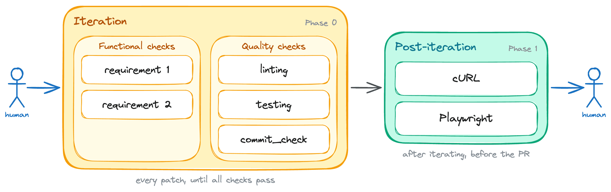](https://www.lucasfcosta.com/assets/backpressure-is-all-you-need/02-post-iteration.png "Click to enlarge")

Manual testing with cURL and a real browser becomes a new post-iteration phase, run once the iteration loop settles.  
使用 cURL 和真实浏览器进行手动测试成为迭代后的新阶段，在迭代循环稳定后运行。

### 3\. Benchmarking 3. 基准测试

Some of the applications with which I work are performance-sensitive, so I also added benchmarking into the loop for those.  
我工作中的一些应用程序对性能敏感，因此我也为这些应用程序将基准测试添加到循环中。

Writing that into the prompt was easy, but making the benchmarking suite easy to run and interpret was a bit more work. Still, I invested significant time in improving our benchmarking tools so that they would:  
将内容写入提示词很简单，但要使基准测试套件易于运行和解释则稍微费了点功夫。不过，我还是投入了大量时间来改进我们的基准测试工具，以便它们能够：

1. **Be easy to run with a single command**, so that the model could run them frequently without getting into rabbit holes.  
	易于通过单条命令运行，以便模型可以频繁运行它们而不会陷入死胡同。
2. **Include multiple suites with different time budgets**, so that the model wouldn't get stuck for 10m running benchmarks when it just needed a quick sanity check.  
	包含多个具有不同时间预算的套件，以便模型在只需要快速检查时不会卡在运行基准测试 10 分钟的情况。
3. **Write structured output to disk and the console**, so that the model could easily understand whether a change was an improvement, a regression, or a wash.  
	将结构化输出写入磁盘和控制台，以便模型可以轻松理解一个变化是改进、回归还是无关紧要。

**I also created a skill specifically for running benchmarks and interpreting their results**. This skill included instructions on which suite to pick, the heuristics for interpreting results, and clear acceptance criteria for what counts as a regression, an improvement, or a wash.  
我也创建了一个专门用于运行基准测试和解释其结果的技能。这个技能包括选择哪个套件、解释结果的启发式方法以及明确哪些情况算作回归、改进或持平的验收标准。

With that skill in place, I updated the prompt to make the model run benchmarks for any performance-sensitive applications.  
有了这个技能，我更新了提示，让模型为任何性能敏感的应用程序运行基准测试。

```
/goal implement support for <brief feature description>. Here are the feature's acceptance criteria:
 
1. <first criterion: i.e. the button X must be disabled while the form is submitting>
2. <second criterion: i.e. the front-end must show an error message if the API returns a 400>
3. <third criterion: i.e. redirect the user to the dashboard after a successful submission>
 
The task is not done until all of the above acceptance criteria are satisfied. Additionally, the following quality criteria must also be met:
 
1. The linting is passing
2. Tests are all green
3. The new behavior is covered by tests
4. The commit_check.sh script is passing
5. Run the benchmarks using the \`run_benchmarks\` skill. See the acceptance criteria inside it.
 
Run these quality checks in _each_ iteration. Do NOT wait until the end to run them. You should run them after writing each patch, and you should not write a new patch until all checks are passing.
 
After you're done iterating:
 
1. Use the \`run_local_dependencies\`, \`run_backend\`, and \`run_frontend\` skills to run the application locally and test the new behavior manually. You can use \`cURL\` commands to test the API endpoints and the Playwright MCP to test the front-end on a real browser. You should run these manual checks at least once before considering the task done, but you can run them more than once if you think it's necessary to catch issues that automated tests might have missed.
2. Use the \`run_benchmarks\` skill to run the full benchmarking suite. See the acceptance criteria inside it.
 
If any of the above criteria are not met, you must inspect the failure, fix the issue, and run the check again. Do not stop after writing the patch. Stop only after the acceptance criteria are satisfied, or after you can explain exactly what is blocking you.
```

After this change, the process includes a new step within the iteration *and* post-iteration phases.  
在此更改后，流程在迭代和迭代后阶段包含一个新步骤。

[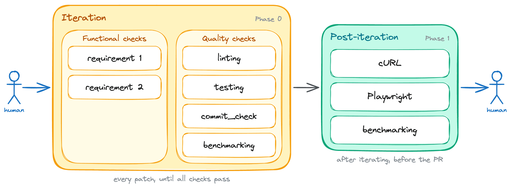](https://www.lucasfcosta.com/assets/backpressure-is-all-you-need/03-benchmarking.png "Click to enlarge")

Benchmarking joins both the iteration loop and the post-iteration phase for performance-sensitive applications.  
性能敏感的应用程序中，基准测试同时包含迭代循环和迭代后阶段。

### 4\. Review agents (functional, tests, types, brevity)4. 审查代理（功能、测试、类型、简洁性）

Review agents were the most effective form of backpressure that I added to the loop, by far.  
审查代理是我添加到循环中的最有效的背压形式，远超其他方式。

I added review agents after noticing the types of issues that still reached me. The earlier layers caught most correctness issues, but the quality problems remained.  
我在注意到仍然有类型问题达到我之后添加了审查代理。早期层捕获了大多数正确性问题，但质量问题仍然存在。

Those quality problems included things like readability, excessive complexity, lack of tests, loose types, and explicit casts.  
那些质量问题包括可读性、过度复杂性、缺乏测试、松散类型和显式类型转换等问题。

Given that those issues are quite subjective, I built a review skill that included a bit of each of those criteria, and I made it run in each iteration. That way, the model would have to confront a reviewer's opinions more frequently, which made it more likely to catch quality issues on its own instead of relying on me to point them out.  
鉴于这些问题相当主观，我构建了一个评审技能，其中包含这些标准的部分，并使其在每个迭代中运行。这样，模型将不得不更频繁地面对评审员的意见，这使得它更有可能自行发现质量问题，而不是依赖我指出它们。

Once I finished that skill, I updated the prompt to include it as another backpressure mechanism in the iteration loop.  
一旦我完成了这个技能，我更新了提示，将其作为迭代循环中的另一个背压机制包含在内。

```
/goal implement support for <brief feature description>. Here are the feature's acceptance criteria:
 
1. <first criterion: i.e. the button X must be disabled while the form is submitting>
2. <second criterion: i.e. the front-end must show an error message if the API returns a 400>
3. <third criterion: i.e. redirect the user to the dashboard after a successful submission>
 
The task is not done until all of the above acceptance criteria are satisfied. Additionally, the following quality criteria must also be met:
 
1. The linting is passing
2. Tests are all green
3. The new behavior is covered by tests
4. The commit_check.sh script is passing
5. Run the benchmarks using the \`run_benchmarks\` skill. See the acceptance criteria inside it.
6. Use the \`review_agent\` skill to review the code
 
Run these quality checks in _each_ iteration. Do NOT wait until the end to run them. You should run them after writing each patch, and you should not write a new patch until all checks are passing.
 
After you're done iterating:
 
1. Use the \`run_local_dependencies\`, \`run_backend\`, and \`run_frontend\` skills to run the application locally and test the new behavior manually. You can use \`cURL\` commands to test the API endpoints and the Playwright MCP to test the front-end on a real browser. You should run these manual checks at least once before considering the task done, but you can run them more than once if you think it's necessary to catch issues that automated tests might have missed.
2. Use the \`run_benchmarks\` skill to run the full benchmarking suite. See the acceptance criteria inside it.
3. Run the \`review_agent\` skill one last time, but now tell it to review the changeset as a whole.
 
If any of the above criteria are not met, you must inspect the failure, fix the issue, and run the check again. Do not stop after writing the patch. Stop only after the acceptance criteria are satisfied, or after you can explain exactly what is blocking you.
```

This change added a new backpressure mechanism to both phases of the process, and significantly reduced the number of quality issues that slipped through to me.  
这项更改向流程的两个阶段添加了一种新的背压机制，并显著减少了质量问题流入我的数量。

[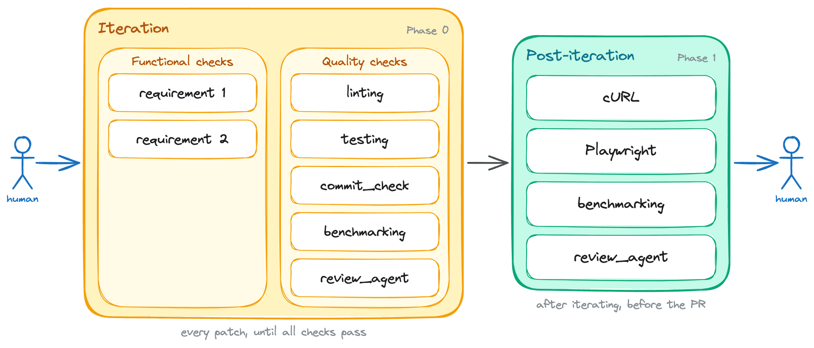](https://www.lucasfcosta.com/assets/backpressure-is-all-you-need/04-review-agents.png "Click to enlarge")

Review agents run in every iteration, and once more over the whole changeset after iterating.  
审查代理在每个迭代中运行，并且在迭代完成后，再次在整个变更集中运行。

The next steps for this particular backpressure mechanism are to experiment with breaking down the review into multiple agents, each with a specific focus. I'm also not yet sure if it's best to ship this mechanism as a `SKILL.md` or an `/agents/reviewer_agent.md`.  
针对这种特定的背压机制，下一步是尝试将其分解为多个代理，每个代理具有特定的关注点。我目前还不确定是将这种机制作为 `SKILL.md` 还是 `/agents/reviewer_agent.md` 发送是最好的。

### 5\. Planning phase review5. 规划阶段审查

Every backpressure mechanism I've covered so far targets the implementation phase. Those worked, but the model would sometimes pick the wrong approach from the start and it couldn't course-correct its way out of a bad foundation.  
到目前为止，我所介绍的所有背压机制都针对实施阶段。这些机制是有效的，但模型有时从一开始就会选择错误的方法，并且无法从不良的基础中纠正自己的错误。

I addressed that by adding a review step in the planning phase, right after the model creates the initial plan but before it starts writing code. In this case, Claude would spawn a reviewer subagent to check whether the fundamental approach was sound and it would iterate on the plan until the reviewer approved it. Only then would it move on to the implementation phase.  
我在规划阶段增加了一个评审步骤来解决这一问题，即在模型创建初始计划之后、开始编写代码之前。在这种情况下，Claude 会生成一个评审子代理来检查基本方法是否可行，并会迭代计划直到评审者批准。只有到那时，它才会进入实施阶段。

I was also careful to mention that this should be a lightweight plan, focused mostly on the approach and the architecture, and *not* on implementation details. That's because I wanted to defer implementation details to the implementation phase, where the model could ask reviewers for feedback and course-correct as it went along.  
我也小心地提到这应该是一个轻量级的计划，主要关注方法和架构，而不是实现细节。这是因为我想将实现细节推迟到实施阶段，在那里模型可以请求审阅者的反馈并边进行边调整。

```
/goal implement support for <brief feature description>. Here are the feature's acceptance criteria:
 
1. <first criterion: i.e. the button X must be disabled while the form is submitting>
2. <second criterion: i.e. the front-end must show an error message if the API returns a 400>
3. <third criterion: i.e. redirect the user to the dashboard after a successful submission>
 
Before writing any code, produce a lightweight plan that focuses on the overall approach and architecture, _not_ on implementation details. Then, use the \`review_agent\` skill to review the plan and confirm the fundamental approach is sound. Keep iterating on the plan until the reviewer approves it, and only then move on to the implementation.
 
The task is not done until all of the above acceptance criteria are satisfied. Additionally, the following quality criteria must also be met:
 
1. The linting is passing
2. Tests are all green
3. The new behavior is covered by tests
4. The commit_check.sh script is passing
5. Run the benchmarks using the \`run_benchmarks\` skill. See the acceptance criteria inside it.
6. Use the \`review_agent\` skill to review the code
 
Run these quality checks in _each_ iteration. Do NOT wait until the end to run them. You should run them after writing each patch, and you should not write a new patch until all checks are passing.
 
After you're done iterating:
 
1. Use the \`run_local_dependencies\`, \`run_backend\`, and \`run_frontend\` skills to run the application locally and test the new behavior manually. You can use \`cURL\` commands to test the API endpoints and the Playwright MCP to test the front-end on a real browser. You should run these manual checks at least once before considering the task done, but you can run them more than once if you think it's necessary to catch issues that automated tests might have missed.
2. Use the \`run_benchmarks\` skill to run the full benchmarking suite. See the acceptance criteria inside it.
3. Run the \`review_agent\` skill one last time, but now tell it to review the changeset as a whole.
 
If any of the above criteria are not met, you must inspect the failure, fix the issue, and run the check again. Do not stop after writing the patch. Stop only after the acceptance criteria are satisfied, or after you can explain exactly what is blocking you.
```

This change added an entirely new phase before the implementation even starts. Now, the model has to get its approach reviewed and approved before it writes a single line of code.  
这次变更在实施开始之前增加了一个全新的阶段。现在，模型必须在编写一行代码之前获得其方法的审查和批准。

[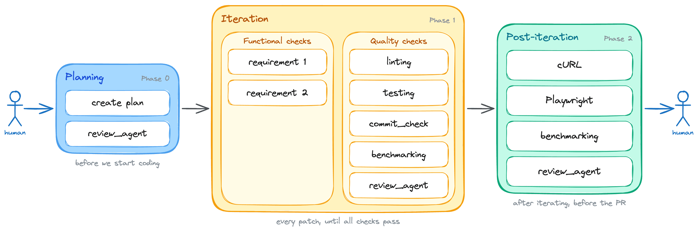](https://www.lucasfcosta.com/assets/backpressure-is-all-you-need/05-planning.png "Click to enlarge")

A planning phase is added up front: the approach is reviewed and approved before any code is written.  
在前面增加了规划阶段：在编写任何代码之前，方法将得到审查和批准。

### 6\. Visual design reviews6. 视觉设计评审

I'm honestly not sure about the efficacy of visual design reviews as a backpressure mechanism, but I think it's worth exploring.  
说实话，我不确定视觉设计评审作为背压机制的有效性，但我认为值得探索。

This mechanism is especially relevant for front-end work, where the visual design is a critical aspect of the user experience. It's also an area where automated checks and even manual testing might not be sufficient to catch issues, especially when it comes to things like layout, spacing, color contrast, and overall aesthetics.  
这种机制特别适用于前端工作，其中视觉设计是用户体验的关键方面。这也是一个自动检查甚至手动测试可能不足以发现问题的领域，尤其是在布局、间距、颜色对比和整体美学等方面。

The way I built this check into the loop was by creating a skill that instructs the model to take screenshots using the Playwright MCP and review them against a Figma file or images from a Linear ticket.  
我将这种检查构建到循环中的方式是创建一个技能，指示模型使用 Playwright MCP 拍摄屏幕截图，并对照 Figma 文件或来自 Linear 票据的图像进行评审。

That skill also included a few heuristics to help the agent compare both images more reliably. These heuristics included a list of common issues to look for, like misaligned elements, inconsistent spacing, color contrast issues, and overall visual consistency. The skill further instructed the model to break down the review into smaller parts, like checking the header, then the main content, then the footer, and so on.  
该项技能还包含了一些启发式方法来帮助代理更可靠地比较两张图像。这些启发式方法包括一个常见问题列表，例如错位元素、不一致的间距、颜色对比问题和整体视觉一致性。该技能进一步指示模型将审查分解成更小的部分，例如检查页眉，然后是主要内容，然后是页脚，等等。

```
/goal implement support for <brief feature description>. Here are the feature's acceptance criteria:
 
1. <first criterion: i.e. the button X must be disabled while the form is submitting>
2. <second criterion: i.e. the front-end must show an error message if the API returns a 400>
3. <third criterion: i.e. redirect the user to the dashboard after a successful submission>
 
Before writing any code, produce a lightweight plan that focuses on the overall approach and architecture, _not_ on implementation details. Then, use the \`review_agent\` skill to review the plan and confirm the fundamental approach is sound. Keep iterating on the plan until the reviewer approves it, and only then move on to the implementation.
 
The task is not done until all of the above acceptance criteria are satisfied. Additionally, the following quality criteria must also be met:
 
1. The linting is passing
2. Tests are all green
3. The new behavior is covered by tests
4. The commit_check.sh script is passing
5. Run the benchmarks using the \`run_benchmarks\` skill. See the acceptance criteria inside it.
6. Run the \`visual_review\` skill to review the actual screenshots of the new feature against the design specifications
7. Use the \`review_agent\` skill to review the code
 
Run these quality checks in _each_ iteration. Do NOT wait until the end to run them. You should run them after writing each patch, and you should not write a new patch until all checks are passing.
 
After you're done iterating:
 
1. Use the \`run_local_dependencies\`, \`run_backend\`, and \`run_frontend\` skills to run the application locally and test the new behavior manually. You can use \`cURL\` commands to test the API endpoints and the Playwright MCP to test the front-end on a real browser. You should run these manual checks at least once before considering the task done, but you can run them more than once if you think it's necessary to catch issues that automated tests might have missed.
2. Use the \`run_benchmarks\` skill to run the full benchmarking suite. See the acceptance criteria inside it.
3. Run the \`review_agent\` skill one last time, but now tell it to review the changeset as a whole.
 
If any of the above criteria are not met, you must inspect the failure, fix the issue, and run the check again. Do not stop after writing the patch. Stop only after the acceptance criteria are satisfied, or after you can explain exactly what is blocking you.
```

Again, this mechanism ended up as a new item in the iteration phase. I'm still not sure if it's worth the hassle, but I think it's an interesting experiment to run, especially for front-end work where the visual design is a critical aspect of the user experience.  
再次，这个机制最终成为了迭代阶段的新项目。我仍然不确定这是否值得费心，但我认为这是一个有趣的实验，特别是对于前端工作，其中视觉设计是用户体验的关键方面。

[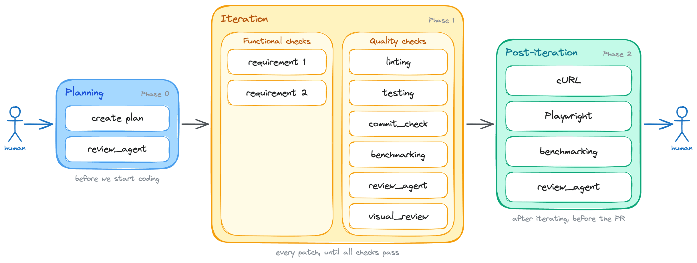](https://www.lucasfcosta.com/assets/backpressure-is-all-you-need/06-visual-review.png "Click to enlarge")

Visual design reviews join the iteration loop, mainly for front-end work.  
视觉设计评审加入了迭代循环，主要用于前端工作。

### 7\. Pull-request monitoring7. 拉取请求监控

Monitoring pull requests was probably the second most effective form of backpressure that I added to the loop, right after review agents.  
监控拉取请求可能是我在循环中添加的最有效的反馈形式之一，仅次于评审代理。

I added this mechanism after noticing that issues still slipped through even with the review agent in place. They were usually conflicts, failing CI checks, or comments from another reviewer agent on the PR.  
我在发现即使有审查代理机制，问题仍然会漏过后，添加了这个机制。它们通常是冲突、失败的 CI 检查，或来自另一个审查代理的 PR 评论。

I built this mechanism by creating a skill that monitors the PR for a certain amount of time after it's opened. During that time, the skill checks for any new comments, CI status changes, or merge conflicts. If it detects any of those issues, it sends a notification to the model and instructs it to address the issue before considering the task done.  
我通过创建一个技能来构建这个机制，该技能在 PR 打开后会监控一段时间。在这段时间内，该技能会检查任何新的评论、CI 状态变化或合并冲突。如果它检测到任何这些问题，它会向模型发送通知，并指示它在考虑任务完成之前解决该问题。

```
/goal implement support for <brief feature description>. Here are the feature's acceptance criteria:
 
1. <first criterion: i.e. the button X must be disabled while the form is submitting>
2. <second criterion: i.e. the front-end must show an error message if the API returns a 400>
3. <third criterion: i.e. redirect the user to the dashboard after a successful submission>
 
Before writing any code, produce a lightweight plan that focuses on the overall approach and architecture, _not_ on implementation details. Then, use the \`review_agent\` skill to review the plan and confirm the fundamental approach is sound. Keep iterating on the plan until the reviewer approves it, and only then move on to the implementation.
 
The task is not done until all of the above acceptance criteria are satisfied. Additionally, the following quality criteria must also be met:
 
1. The linting is passing
2. Tests are all green
3. The new behavior is covered by tests
4. The commit_check.sh script is passing
5. Run the benchmarks using the \`run_benchmarks\` skill. See the acceptance criteria inside it.
6. Run the \`visual_review\` skill to review the actual screenshots of the new feature against the design specifications
7. Use the \`review_agent\` skill to review the code
 
Run these quality checks in _each_ iteration. Do NOT wait until the end to run them. You should run them after writing each patch, and you should not write a new patch until all checks are passing.
 
After you're done iterating:
 
1. Use the \`run_local_dependencies\`, \`run_backend\`, and \`run_frontend\` skills to run the application locally and test the new behavior manually. You can use \`cURL\` commands to test the API endpoints and the Playwright MCP to test the front-end on a real browser. You should run these manual checks at least once before considering the task done, but you can run them more than once if you think it's necessary to catch issues that automated tests might have missed.
2. Use the \`run_benchmarks\` skill to run the full benchmarking suite. See the acceptance criteria inside it.
3. Run the \`review_agent\` skill one last time, but now tell it to review the changeset as a whole.
 
If all the above have been done, approved, and there is nothing else left to do:
 
1. Open the PR with the changes.
2. Use the \`monitor_pr\` skill to monitor the PR for any new comments, CI status changes, or merge conflicts for the next 24 hours. If any of those issues are detected, address them before considering the task done.
 
If any of the above criteria are not met, you must inspect the failure, fix the issue, and run the check again. Do not stop after writing the patch. Stop only after the acceptance criteria are satisfied, or after you can explain exactly what is blocking you.
```

The final backpressure loop looked like this:  
最终的背压循环如下所示：

[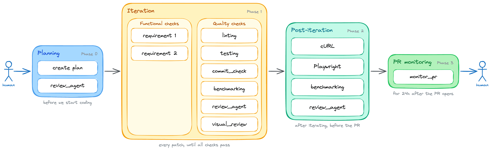](https://www.lucasfcosta.com/assets/backpressure-is-all-you-need/07-full-loop.png "Click to enlarge")

The full backpressure loop: from a goal all the way to a PR that lands clean, with checks gating every phase.  
完整的背压循环：从一个目标一直到一个干净合并的 PR，每个阶段都有检查门控。

## How to try this backpressure loop yourself如何自己尝试这个背压循环

I have packaged this backpressure loop into a skill and made it **available at [`@lucasfcosta/backpressured`](https://www.npmjs.com/package/@lucasfcosta/backpressured)**. The source is publicly [available on GitHub](https://github.com/lucasfcosta/backpressured).  
我将这个背压循环打包成一个技能，并在 `@lucasfcosta/backpressured` 提供。源代码在 GitHub 上公开可用。

[](https://www.lucasfcosta.com/assets/backpressure-is-all-you-need/loop.png "Click to enlarge")

The flow the skill runs: from a goal all the way to a PR that lands clean, with backpressure gates at each step.  
该技能运行的流程：从一个目标一直到一个干净合并的 PR，每个步骤都有背压门控。

**You can install this skill in your terminal using `npx @lucasfcosta/backpressured`**.  
您可以使用 `npx @lucasfcosta/backpressured` 在终端中安装此技能。

After installing it, **run `/backpressured <goal description>` in Claude** to start the loop — or just ask Claude to use the backpressured skill. The skill only runs when you invoke it explicitly; it won't auto-trigger on other prompts.  
安装后，在 Claude 中运行 `/backpressured <goal description>` 以启动循环——或者只需让 Claude 使用反向压力技能。该技能仅在您显式调用时运行；它不会在其他提示下自动触发。

Then, **the skill will iterate towards the goal on its own while running the backpressure checks described in this post**. You can also customize the checks and the iteration process by adding a `BACKPRESSURE.md` file to your project.  
然后，该技能将根据本文中描述的反向压力检查，自行迭代向目标前进。您还可以通过向项目中添加一个 `BACKPRESSURE.md` 文件来自定义检查和迭代过程。

## What's next? 接下来是什么？

I'm not yet sure a `SKILL.md` is the correct way to package a workflow like this. I wish there were an easier way of enforcing this workflow more natively in the model, without having to rely on a skill that can be ignored or bypassed.  
我还不确定使用 `SKILL.md` 来打包这种工作流是否正确。我希望有一种更自然的方式来强制在模型中执行此工作流，而无需依赖一个可以被忽略或绕过的能力。

I also want to experiment with breaking down the review agent into multiple agents, each with a specific focus, like readability, complexity, testing, types, and so on. That way, I can have more targeted feedback and make it easier for the model to understand and address specific issues.  
我还想尝试将审查代理分解为多个代理，每个代理都有特定的关注点，比如可读性、复杂性、测试、类型等等。这样，我可以获得更有针对性的反馈，并使模型更容易理解和解决特定问题。

Anyway, regardless of *how* we implement backpressure or package it, I'm pretty sure this is the direction software engineering is headed. We've spent decades moving the "no" off humans. Now we have to do it again, for code that writes itself.  
无论如何，无论我们如何实现背压或打包，我相当确定这是软件工程发展的方向。我们已经花费了几十年时间将“不”从人类身上移开。现在，我们必须再次为自动编写的代码做到这一点。

**My maxim: any system that relies on a human to catch the machine's mistakes will be limited by the human, not the machine.  
我的格言：任何依赖人类捕获机器错误的系统都将受限于人类，而不是机器。**