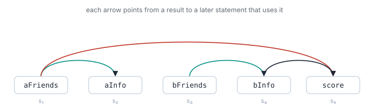

This started when someone mentioned, mostly in passing, that GHC has a flag for ApplicativeDo (`-foptimal-applicative-do`) that’s switched off by default because the algorithm behind it is too slow to use.

That sounded like a bug to me. An optimization that’s correct but disabled for being slow is the kind of thing you fix in an afternoon, I figured.

It wasn’t; it turned out to be a properly hard problem, and the problem has been eating at me for months.

`ApplicativeDo` is a quiet corner of GHC to start with. Most programs never switch it on, and most of the ones that do are fine with the default and never reach for the optimal flag, so we’re well into the weeds even by compiler-internals standards. But the problem under the flag is a good one, and chasing improvements to the algorithmic compexity for the optimal layout algorithm led somewhere I didn’t expect: the same dynamic program biologists use to predict how a strand of RNA folds.

## What is ApplicativeDo, and why is it cool?

Consider a canonical example of fetching the number of friends two people have in common from a remote social graph:

```haskell
numCommonFriends x y = do
  fx <- friendsOf x
  fy <- friendsOf y
  return (length (intersect fx fy))
```

The standard `do` desugaring turns this into sequential binds:

```haskell
friendsOf x >>= \fx ->
friendsOf y >>= \fy ->
  return (length (intersect fx fy))
```

This is strictly sequential. The second `friendsOf` call cannot start until the first one completes, because `>>=` passes the result of the left side to the right side. Even though `fy` does not depend on `fx`, `>>=` has no way to express that independence. We pay for two distinct network round-trips.

These two fetches can be written with `Applicative`:

```haskell
(\fx fy -> length (intersect fx fy)) <$> friendsOf x <*> friendsOf y
```

The independence is now encoded in the types. `<*>` has the type `f (a -> b) -> f a -> f b`, meaning the second argument cannot depend on the first. A monad like [Haxl](https://github.com/facebook/Haxl) exploits this by batching computations combined with `<*>` into a single round. Two friend-list lookups become one trip to the database.

Writing the `<*>` version by hand is fragile. Adding a dependency between two statements requires refactoring back to `>>=`; removing one means you might leave performance on the table if you forget to switch to `<*>`. `ApplicativeDo` allows developers to write plain `do` notation while the compiler determines where it can legally use `<*>`.

The compiler’s task is to take a sequence of statements, determine the dependencies, and group independent statements under `<*>`, falling back to `>>=` only when a dependency forces it.

## The cost of optimal scheduling

Grouping independent statements isn’t always straightforward, and different groupings yield different performance characteristics. Consider this block:

```haskell
do
  aFriends <- friendsOf alice
  aInfo    <- profilesOf aFriends          -- needs aFriends
  bFriends <- friendsOf bob
  bInfo    <- profilesOf bFriends          -- needs bFriends
  score    <- compatibility aFriends bInfo -- needs aFriends and bInfo
  return (aInfo, bInfo, score)
```

Tracing the dependencies: `aInfo` needs `aFriends`; `bInfo` needs `bFriends`; `score` needs both `aFriends` and `bInfo`. The two `friendsOf` calls are entirely independent.

Because Haxl batches everything under a `<*>` into one round, the metric we care about is the total number of rounds. Fewer rounds mean lower latency.


GHC’s default algorithm works greedily: it grabs the longest run of independent statements from the front, emits it, and repeats. Starting from the front, `aFriends` cannot be grouped with `aInfo` (which depends on it), so the first group is `aFriends` alone. This greedy decision pushes everything else a round later, resulting in four total rounds.

The optimal plan lines the two halves up side by side. The two friend-lookups share round 1, the two profile-lookups share round 2, and `score` waits for both in round 3. This saves a full round-trip.

The optimal algorithm finds this three-round schedule, but it is `O(n³)`. In the original paper that introduced the feature ([*Desugaring Haskell’s do-notation Into Applicative Operations*](https://www.microsoft.com/en-us/research/wp-content/uploads/2016/08/desugaring-haskell-haskell16.pdf)), a worst-case `do` block with 1,000 sequential statements took 55 seconds to compile using the optimal algorithm, compared to under two seconds for the greedy heuristic. Consequently, the optimal algorithm lives behind a flag that is rarely enabled.

The goal is to achieve the optimal answer without paying the `O(n³)` cost.

## Reducing the problem

The statements and their contents are irrelevant; only the dependencies matter. We can model the statements as a sequence of nodes, with directed edges representing dependencies:



The compiler builds a tree over these statements without reordering them. Every node is either a sequential or parallel combination:

```haskell
data Tree = Leaf Stmt | Seq Tree Tree | Par Tree Tree
```

`Par` is only legal when its two sides have no dependencies between them. The cost of a tree is the number of rounds it takes:

```haskell
cost (Leaf _)  = 1
cost (Seq l r) = cost l + cost r        -- sequential: rounds add up
cost (Par l r) = max (cost l) (cost r)  -- parallel: wait for the slower branch
```

The objective is to find the minimum-cost legal tree. The recurrence relation from the paper operates over a span of statements from `i` to `j`:

The `O(n³)` complexity comes entirely from the last line. There are `O(n²)` spans, and for each tangled span, the algorithm tries `O(n)` split points.

The paper optimizes this by noting that in a tangled blob, you only need to check the two extreme cuts—peeling off the first statement or the last. Unless those two cuts tie, one of them is provably optimal, reducing the work to `O(1)`.

Why does this extreme-cut shortcut work? Any split of a tangled blob must be sequential, so splitting at `k` gives a cost of `C[i,k] + C[k+1,j]`. Because adding statements to a block can only increase its cost (or leave it the same), the cost function is monotonically increasing. If we peel off just the first statement (`k=i`), the cost is `1 + C[i+1,j]`. If we peel off the last statement (`k=j-1`), the cost is `C[i,j-1] + 1`. Any cut deeper in the middle would sum two larger sub-blocks, which by monotonicity cannot be strictly cheaper than peeling off a single statement from the edge. The only case where we must search further is if these two extreme cuts tie, because a deeper cut *might* also tie them, but it will never beat them unless the extreme cuts themselves are tied. The remaining challenge is resolving those ties.


Two nearly identical dependency structures can have different costs based entirely on whether one long dependency spans the others. The paper leaves the efficient resolution of these ties as an open question.

## Failed heuristics

A natural first instinct is to assume the cost is simply the longest chain of dependencies. If statement A feeds B, which feeds C, they force at least three rounds. However, the right-hand example above has a longest chain of two arrows, but a cost of three. The restriction against reordering means the spanning arrow prevents separating the halves, forcing an extra round. The factor that forces the extra round is not visible locally; it requires a real minimum over a real search.

Another approach is to invert the 2D table of spans: for each starting statement and each round budget, calculate how far right the sequence can extend. This one-dimensional, monotonic approach turns the tie into a boolean check of whether the next chunk fits the budget.

A differential tester quickly disproves this approach:


In the highlighted window (statements two through six), the left and right halves have no dependencies between them, allowing them to run in parallel for a cost of two. However, a left-to-right scan starting at statement two follows an arrow out to statement seven. Because the arrow’s head is outside the window, the scan assumes the blob runs all the way to seven, entirely missing the parallel seam between four and five.

The structure inside a window depends on both of its ends. An arrow leaving on the right alters the internal structure, and a one-sided scan cannot detect it. The 2D table is necessary.

## Bounding the search

The pathological input that causes the 55-second compile time is a long chain where every statement depends on the previous one, with zero parallelism. Every span in that input results in a tie, and the naive algorithm checks `O(n)` cuts for each one.

In a tie, the answer is known to be either `c` or `c+1`, and the longest chain is a lower bound. If the longest chain through the span already equals `c+1`, the lower bound meets the upper bound, and the search can terminate immediately:

```haskell
-- in a tie, with the answer pinned to either c or c+1:
if longestChain[i,j] == c + 1 then c + 1
```

For a pure chain, the longest chain through a span is its length, which is always `c+1`. This condition fires on every tie, so the cost is known without searching to rule out a cheaper split. We still scan to recover the actual cut for the tree, but the first split point we try is already a witness—so the per-span work drops from linear to a single check, and the whole pass collapses from `O(n³)` to `O(n²)`.

Combining this with the paper’s existing optimizations-taking parallelism when available and using the extreme-cut shortcut for non-ties—drastically reduces the workload:

|  | Input | Naive Cut Checks | Optimized Cut Checks |
| --- | --- | --- | --- |
| 50 | chain | 20,825 | 1,225 |
| 100 | chain | 166,650 | 4,950 |
| 200 | chain | 1,333,300 | 19,900 |
| 50 | realistic | 1,550 | 322 |
| 100 | realistic | 4,544 | 1,426 |
| 200 | realistic | 47,471 | 3,583 |
| 100 | two\_chains | 166,551 | 7,252 |
| 50 | dense | 20,729 | 1,521 |
| 150 | dense | 562,178 | 14,554 |
| 50 | hub | 1,225 | 1,225 |
| 200 | hub | 19,900 | 19,900 |

The optimized counts are total work: every cut evaluation performed to produce the optimal tree, not just its cost. On the chain the per-span search disappears, leaving the unavoidable `O(n²)` witness-recovery pass; realistic blocks land roughly an order of magnitude below naive. (The trees are identical to the naive ones in every row—same schedule, just do less work.) This does not guarantee a quadratic worst case: a dense blob held together by long spanning arrows with internal parallelism still trends toward cubic. The `hub` rows — every statement feeding one final sink — the one pattern that’s just a draw: each span ties at cost two, but the longest chain is also two, so the bound never closes and the optimizer scans exactly as much as the naive one. The shortcut helps where a long chain pins the cost; it cannot help where there is no long chain to begin with. Such shapes are rare in real code, and that residual dense case is exactly what the algorithm below is built for.

## The connection to computational biology

To understand why this problem is tractable at all, we can look to computational biology.

RNA is typically a single strand of bases (`A`, `U`, `G`, `C`). Without a second strand to pair with, the strand pairs with itself. Complementary stretches fold back and stick together into stems and hairpins.

```plaintext
5'─ G C A U U ... 
    │ │ │ │ │      a stretch folds back and pairs with a
    C G U A A ...  complementary stretch further along
```

The resulting structure is the strand’s secondary structure. Physically, it settles into the configuration with the lowest free energy (roughly, the most pairs). Predicting this fold is an optimization problem traditionally solved by Nussinov’s algorithm (1978).

Over a stretch from `i` to `j`, either the first base is unpaired, or it bonds with some base `k`, walling off one sub-structure inside and another outside: `best[i,j] = max over the split point k of (inside + outside)`. This uses the same triangular table, the same `O(n³)` complexity, and the same combine-over-a-split-point recurrence as the `ApplicativeDo` cost function.

A `do` block is structurally identical to a polymer. The statements are residues along a backbone. The dependency arrows are bonds constraining the fold. The compiler is performing structure prediction, hunting for the lowest-energy configuration, where “energy” is latency. Monadic binds are stiff stretches of backbone; applicative groups are domains that fold independently.

This resemblance is rooted in a shared constraint. In RNA secondary structure prediction, the standard model forbids bonds from crossing: if base `i` pairs with base `j`, and base `k` sits between them, `k` ’s partner must also sit between them. Bonds nest; they do not interleave.

In `ApplicativeDo`, the matching rule is that statements cannot be reordered. The resulting tree is an ordered bracketing of the sequence, which nests cleanly. Non-crossing and no-reordering are the same mathematical prohibition, and it is this nesting that collapses an exponential search space into a polynomial one.

If you allow RNA bonds to cross (pseudoknots), folding becomes NP-hard. If you allow `ApplicativeDo` to reorder statements (which is only sound for commutative monads), you lose the nested structure and the problem similarly becomes NP-hard.

Because the problems share this structure, we can borrow advanced solutions. The sequential combine takes the minimum over a sum of two parts (`min(C[i,k] + C[k+1,j])`). This is mathematically a `(min, +)` operation—often called min-plus or tropical matrix multiplication, where minimum replaces addition and addition replaces multiplication. Computing this over a matrix is generally as hard as the all-pairs shortest paths problem. However, the `ApplicativeDo` cost table benefits from the paper’s monotonicity lemma: adjacent entries differ by at most 1.

This is where the connection to parsing comes full circle. In 1975, Leslie Valiant proved that context-free grammar parsing (the `O(n³)` CYK algorithm) could be reduced to boolean matrix multiplication, breaking the cubic barrier and achieving subcubic time. For decades, it was an open question whether the same trick could work for optimization problems like RNA folding, which use `(min, +)` instead of boolean operations. The Bringmann et al. algorithm ([*Truly Sub-cubic Algorithms for Language Edit Distance and RNA Folding via Fast Bounded-Difference Min-Plus Product*](https://arxiv.org/pdf/1707.05095), FOCS 2016) finally achieved this— it is essentially Valiant’s parser for tropical semirings, made possible only because the bounded-difference property keeps the numbers from growing too large.

While our combine flips between `+` (sequential) and `max` (parallel), parallelism is all-or-nothing per span. If a span splits in parallel, it always should; if it doesn’t, every cut inside it is sequential. The cost separates cleanly into a pure `(min, +)` part and a cheap structural `max` part. Dropping the biology machinery directly into the problem yields a worst-case complexity of `Õ(n^2.8244)` randomized (`Õ(n^2.8603)` deterministic), still optimal.

There is, however, one unfortunate little issue that prevents this from being sensible for use in the context of a compiler. Those exponents come wrapped in enormous constant factors. The algorithm leans on fast rectangular matrix multiplication, which is notorious for having overhead so large that the crossover point where `n^2.82` actually beats a well-tuned `n³` is far past any `do` block a human will ever write. For GHC specifically, this is the wrong tool. The segment decomposition plus the longest-chain tie-breaker from the previous section is what makes the optimal algorithm usably fast on real code, and that is a small, local change to the existing path. The sub-cubic result is a statement about the *problem* — that the cube is not fundamental— rather than a recipe for the compiler.

## Conclusion

So, my curiosity is satisfied. I can begin thinking about new things in the shower.

The practical fix and the theoretical one rely on the same underlying observation: parallelism is all-or-nothing per span. This property allows us to carve the block into independent pieces and confine the expensive search to rare dense blobs. It is the same property that splits the cost into a min-plus part and a structural-max part.

The `O(n³)` complexity being so brutal for compilation times was largely an artifact of treating the tie as a search space rather than analyzing the constraints of the dependencies. By applying the longest-chain bound and the extreme-cut shortcut, the compile-time cliff in GHC’s optimal path can be effectively eliminated— and the dense worst case that survives is, satisfyingly, deeply mirrors nature’s own computational machinery.