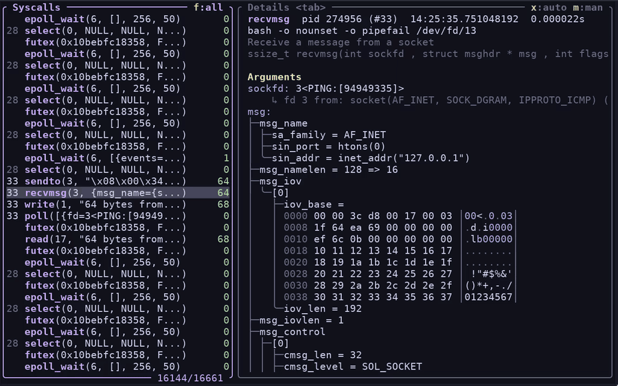
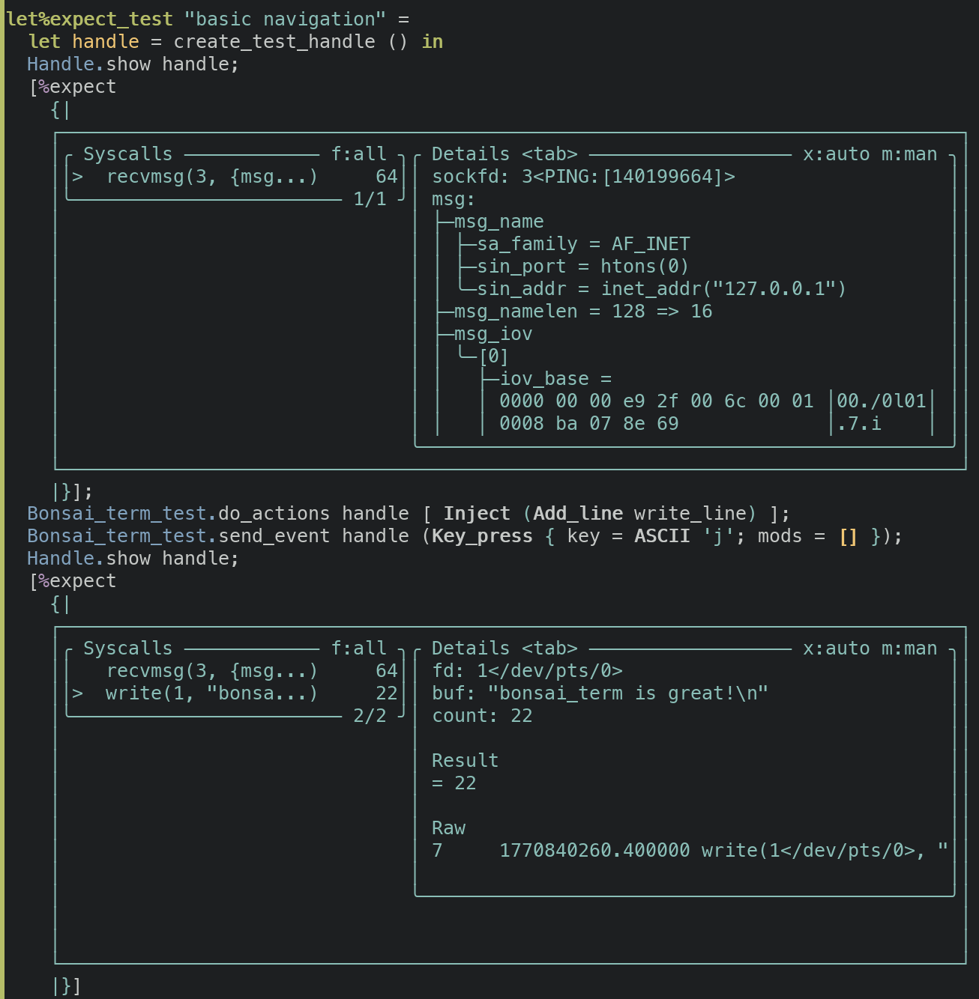
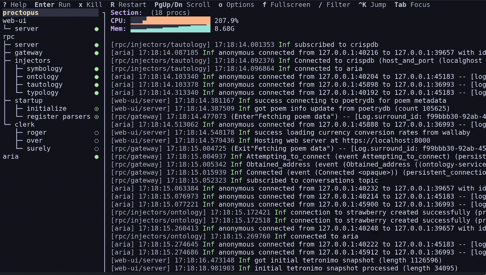
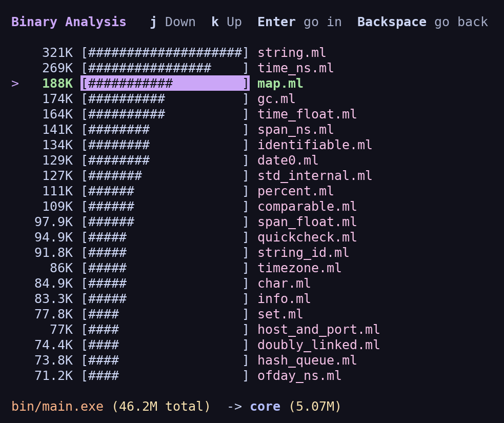

We’ve always found strace useful but somewhat hard to work with. Its output is often inscrutable, it’s hard to follow subprocesses or threads, and if you want to filter syscalls you have to rerun the trace with a flag for each one. What you want in debugging is a tool for exploring, refining, etc., but strace can make this difficult.

Enter strace-ui, which turns strace into an interactive terminal UI:



strace-ui assigns short IDs to PIDs to make them easier to scan, formats structs, and renders buffers as hexdumps instead of strings. It has some other nice features that you can’t see in the screenshot:

- Interactive filtering. Tracing an async OCaml process? Did you forget to pass `-e '!futex,timerfd_settime,epoll_wait'`? Don’t worry: press **h** to hide any syscall you don’t care about.
- Trace a particular file-descriptor. Press **\>** or **<** to jump to the next/previous syscall that referenced the same file descriptor, or press **F** to change your filter to only include syscalls that touch a given FD. (it’s slightly smarter than just numeric FD filtering: strace-ui tries to track FD re-use and follow across forks, but it doesn’t do a great job of that if you attach to a process that’s already opened FDs.)
- What even is `rt_sigprocmask`? Press **m** to open the man page and find out.
- Subprocesses or threads are assigned short numeric labels, instead of showing you the raw pid, making it easier to follow a complex `strace -f` calls. (You can also filter by PID or exclude PIDs.)
- DNS resolution: strace’s `--decode-fds=all` will print file descriptors as 14<TCP:\[55.55.555.555:12345->11.11.11.11:56789\]>, which is great. strace-ui goes one step further and prints 14<TCP:\[a-real-hostname:12345->another-hostname:56789\]>, which makes it easier to see at a glance exactly what your process is doing.

[Ian Henry](https://signalsandthreads.com/building-tools-for-traders/), a dev here, made strace-ui to scratch his own itch. In 2017, he’d gone looking for such a tool but never found it. Having had experience building interactive terminal UIs (including in OCaml, using lambda\_term), he knew how difficult and unpleasant it could be. The idea percolated over the years, never feeling worth it, until recently when a few forces converged to make terminal UI development actually kind of delightful.

## Bonsai, a powerful framework for reactive UIs

For years now we’ve been building web applications with OCaml in a functional style, using a library we developed called [Bonsai](https://github.com/janestreet/bonsai), loosely inspired by [Elm](https://elm-lang.org/). A simple Bonsai component with a little interactivity looks like this:

```ocaml
module Dice = struct
  let faces = ...

  let component (graph @ local) =
    let face, set_face = Bonsai.state (List.hd_exn faces) graph in
    let%arr face and set_face in
    {%html|
      <div>
        You rolled a #{face}
        <button
          style=""
          on_click=%{fun _ ->
            let index = Random.int (List.length faces) in
            set_face (List.nth_exn faces index)}
        >Roll the dice</button>
      </div>
    |}
end
```

Components are implemented as purely functional state machines, and are easily composable. Incrementalization inside the framework means that values don’t get recomputed until necessary. This applies to every value, not just the view.

What’s neat about Bonsai is that it allows you to compose state and incrementality primitives a la carte. The same primitives that prevent re-rendering the entire page during user interaction can also be used to incrementalize an expensive business logic computation on a live-updating dataset. (If you’re used to React, imagine if everything used something very similar to hooks, and state was managed outside of the component hierarchy.)

And because Bonsai is written in OCaml, it becomes possible to use the same language and types on both the backend and frontend. It’s hard to overstate the impact this has on keeping a large web app’s codebase manageable, especially when you make pervasive use of OCaml’s type system.

## Bonsai is not really a web framework

So far we’ve actually been talking about Bonsai\_web. Bonsai itself is agnostic to the frontend, because when you think about it, all UIs can fundamentally be expressed as stateful incremental computations, in which different components know how to render themselves as their underlying data changes.

If Bonsai is a library for managing the lifecycle and scoping of state, with a layer on top for expressing the particulars of a given UI surface, you can see how the same underlying core can be adapted. And that is where Bonsai\_term came from.

When Ty Overby made Bonsai in 2019, the idea that it’d eventually end up being used for terminal apps was a running joke. In some ways the whole point of Bonsai was that at Jane Street we felt somewhat underpowered when it came to web development. Some of our most important apps were built on the ancient and somewhat difficult [curses](https://en.wikipedia.org/wiki/Curses_\(programming_library\)) library, which lives up to its name.

Terminal apps are fast and keyboard-centric, which we like, but the web also has a lot going for it. It’s hard to beat the ergonomics of clicking a hyperlink; and of course the web gives you a vast palette for constructing UIs, including charts and graphics that aren’t practical on the command line, and integrated help (via tooltips and the like). In the years after the release of Bonsai\_web there was a huge flowering of web apps, including many that were ported directly from the terminal.

But here we are in 2026 and it feels like another renaissance is afoot, this time in the opposite direction.

## Terminal UIs experience a comeback — the Claude Code effect?

Bonsai\_term began as a personal hobby project in the summer of 2024, when Jose Rodriguez—one of our devs—built it to write a manga reader with the kitty graphics protocol. It showed enough promise that he later made some ncdu-style tools for wider Jane Street use. In April 2025, Bonsai\_term had enough traction that we started productionizing it in earnest.

It so happened that AI agents were coming onto the scene, and it was the arrival of Claude Code in February 2025 that kicked everything into gear. It became clear fairly quickly that a well-made terminal app was winning out over full-featured IDEs, in large part because of the speed, simplicity, and portability of the terminal itself. Terminal emulators are everywhere and deeply integrated into editors; TUIs met devs where they already were. [In the beginning was the command line](https://en.wikipedia.org/wiki/In_the_Beginning..._Was_the_Command_Line), and so it remains—ubiquitous and always at hand.

We doubled down on Bonsai\_term, and pretty soon a feedback loop came into being. We developed our own Claude Code–ish tool, called AIDE, (which we built to maintain the freedom to choose between different model vendors, to suit our unusual development environment, and to better control the execution sandbox), which became both a demo of Bonsai\_term and a partner in creating it. While building AIDE into a full-featured agent-harness, we threw off a rich library of UI components that other apps could then take advantage of.

Developers who became acquainted with this unusually good TUI were pleased to discover that they could make their own terminal apps with just as much polish thanks to the new framework it was built in. Bonsai\_term would feel familiar to anyone who’d ever done web development here, and it had the huge advantage of being especially amenable to AI assistance. It was actually somewhat of a mystery to us *how* good the models were at writing Bonsai\_term code, given how relatively obscure it is and how it relies, for example, on [OxCaml](https://oxcaml.org/) -only features. (We think it might have something to do with the testing story, discussed below.)

Then, recently, with the advent of Bonsai\_term and AI agents, Ian found he could make a working prototype in less than ten minutes. The prototype was useful enough to justify the ongoing time spent making it real.



Notice how the 'expect' block in these tests contains a rendering of the actual UI

## Closing the loop with screenshot tests

One of the most powerful features of Bonsai\_term, which complements AI development nicely, is its testing framework. You can easily write integration tests that literally just walk through using the app in the terminal app and print its state—which looks like a screenshot—at any moment. Because everything is text, this is a straightforward application of our [expect test](https://blog.janestreet.com/the-joy-of-expect-tests/) framework, and as with regular expect tests, regressions or changes in behavior manifest as diffs.

Importantly, these tests are trivial for a coding agent to run and the output is legible for the agent too. That closed loop makes it easy for the AI to check its own work and results in features that are more often correct on the first try. The experience was so good in fact that much of the development time for strace-ui was focused on the kinds of output that the agent couldn’t see from the tests, for instance the performance characteristics of scrolling, filtering, and rendering. (It also had a really hard time with file-descriptor tracking.)

## A million terminal apps bloom

If you watched our internal search engine for mentions of Bonsai\_term, you’d find that a handful of new apps are being built every day. Some examples:

- A time travelling debugger TUI for a trading system.
- A TUI for automating Linux administrative tasks.
- A monitoring TUI for our internal CI system.
- TUIs for orchestrating and monitoring agentic coding sessions.
- A TUI for running and managing agentic evals.
- TUIs for managing deployments and rolls.
- A TUI for exploring logs.
- Terminal charting libraries.

We can’t show screenshots of all of these in a public post, but here are two we can share: `proctopus`, for managing multi-process applications, and `dissect`, for decomposing bloat in executables.

 

The uptick likely goes back to the same forces that led to strace-ui:

- Terminal apps are lightweight, fast, and available everywhere a dev is
- With Bonsai\_term you can build terminal apps in a declarative, type-safe way, sharing code between the backend and frontend
- You don’t need to have used Bonsai before to get started
- AIs “speak Bonsai\_term,” and the closed loop with screenshot-style expect tests means that both you and the agent can see what the app is doing; feedback is fast and accurate
- There’s a healthy component ecosystem, and because Bonsai components are nicely composable you can build fairly sophisticated apps by stitching existing components together

There’s one extra benefit that’s a quirk of how Bonsai\_web works. Bonsai\_web applications are written in OCaml but ported to JavaScript by a transpiler called js\_of\_ocaml. The vagaries of browser APIs mean that some libraries that work fine on a native platform can’t be linked into a js\_of\_ocaml program; and indeed one of the biggest blockers in writing a Bonsai\_web app is in carefully carving out the Javascript-friendly parts of all of your dependent libraries. While much of this carving-out has already been done over the years to support our web-app work, it’s far from complete.

Bonsai\_term doesn’t have this problem, which means that your TUI is more of a regular OCaml program, and can use all the same libraries and tools and services as any other application.

It’s been gratifying to see that getting the ergonomics right actually has a huge effect on developer interest. A lot of devs at Jane Street now reach for Bonsai\_term when building little utilities for themselves or even sophisticated full-fledged applications, where before it might not have been worth the investment. And by dint of being in the terminal these apps are keyboard-driven, lightning-fast, and constrained in a useful way—optimized for usefulness over flash. The web isn’t going anywhere, but seeing terminal apps flourish again is like coming home.

## Appendix: how to try strace-ui, Bonsai\_term, and Proctopus

Want to try Bonsai\_term out? You can read our install instructions [here](https://github.com/janestreet/bonsai_term). You can point your LLM at our [examples repo](https://github.com/janestreet/bonsai_term_examples) and then ask it to build your own TUI. We highly recommend asking your LLM to write expect tests like [this one](https://github.com/janestreet/bonsai_term_examples/blob/with-extensions/pomodoro_timer/test/test_pomodoro_timer.ml) for better results!

You can install `proctopus` and `strace-ui` by following their install instructions in their readmes [here](https://github.com/janestreet/proctopus) and [here](https://github.com/janestreet/strace_ui).